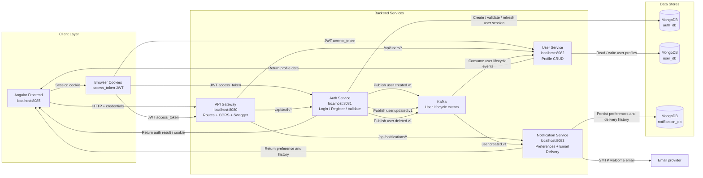
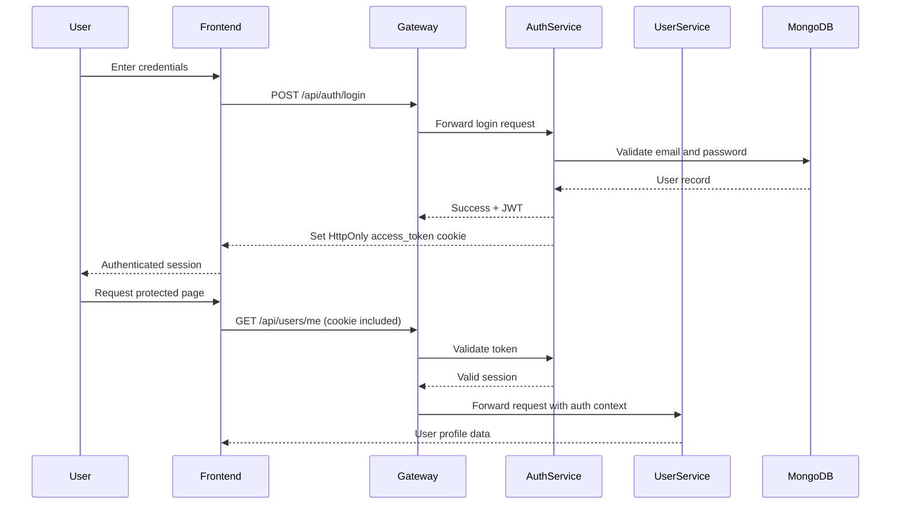
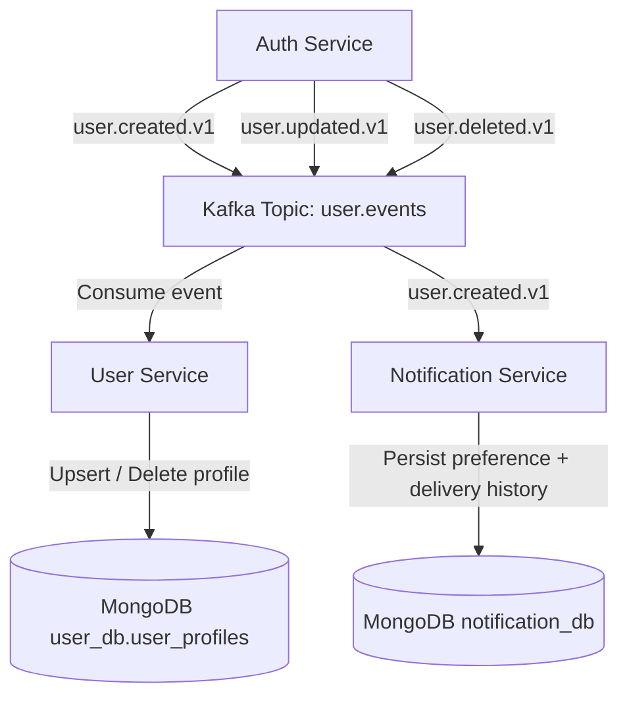

# Project Architecture

This document describes the current high-level architecture and runtime flow for the application.

## High-level architecture

## Request and authentication flow

## Event-driven synchronization flow

## Components

### API Gateway

- Routes requests to the auth, user, and notification services
- Centralizes Swagger and OpenAPI docs
- Handles CORS and credentials-aware browser traffic
- Forwards cookie-based authentication context to downstream services

### Auth Service

- Handles registration, login, logout, and refresh
- Validates credentials against MongoDB
- Creates and validates JWTs
- Emits user lifecycle events to Kafka

### User Service

- Owns user profile state in `user_db`
- Consumes Kafka events to keep profiles synchronized
- Enforces that users only access their own profile data

### Notification Service

- Stores notification preferences and delivery history
- Consumes `user.created.v1` and sends a welcome email when enabled
- Records failed or successful delivery attempts
- Uses optional SMTP configuration and degrades gracefully when email is not configured

## Data model

- `auth_db.auth_users`: authentication records
- `user_db.user_profiles`: synced profile data
- `notification_db.notification_preferences`: per-user email preference
- `notification_db.notification_records`: delivery history and outcomes

## Operational notes

- Browser sessions use HttpOnly cookies; no token is stored in localStorage
- Kafka keeps the services loosely coupled and resilient to async propagation
- The gateway acts as the single public interface for client traffic
- The backend supports both local containerized runs and production deployment via Docker Compose and the `deploy.sh` helper

## Future changes

Proposed follow-up work. Items are prioritized; higher priority should land before infra/product expansions unless a release needs them sooner.

### P0 — Security and correctness

1. **Hash passwords** — Auth currently stores and compares plaintext passwords (`auth-service` register/login). Use bcrypt or argon2 and migrate existing users.
2. **Gateway upstream timeouts** — Proxy calls should use an HTTP client with explicit timeouts (and eventually circuit breakers) instead of the default client.
3. **Auth-side account delete** — `user.deleted.v1` publishing exists, but auth does not delete accounts or emit deletes; user-service delete only removes profiles. Add a full account-deletion path from auth.
4. **Production cookie / TLS settings** — When serving over HTTPS, set `COOKIE_SECURE=true` and an appropriate `COOKIE_SAME_SITE` (e.g. `None` with Secure when cross-site).

### P1 — Reliability and quality

1. **Kafka DLQ + bounded retries / backoff** — Failed consumers can redeliver forever or drop bad events; registration can succeed even when Kafka publish fails. Add dead-letter topics, retry limits, and durable reconciliation where needed.
2. **Integration and contract tests** — Unit tests exist for core packages; add end-to-end coverage for auth → Kafka → user/notification sync and API contracts.
3. **CI pipelines** — Makefile and git hooks exist locally; add CI (e.g. GitHub Actions) for format, lint, test, build, and image validation.
4. **Wire frontend to user APIs** — Backend already exposes list/update/delete; `UserService.listUsers` / `updateProfile` are largely unused, profile is mostly read-only, and the dashboard still uses placeholder stats. Add list/edit/delete UI and remove fake metrics.
5. **Service-level rate limiting** — API Gateway has per-IP token-bucket limiting; add middleware on auth, user, and notification services for defense in depth.

### P1 — Observability

1. **Correlation / `trace_id` propagation** across API Gateway → Auth, User, and Notification services (logs and headers).
2. **OpenTelemetry** instrumentation for distributed traces and metrics.
3. **Prometheus + Grafana** for request latency, error rates, Kafka consumer lag, and notification delivery outcomes.

### P2 — Product and infrastructure

1. **Additional notification channels** — Extend beyond email (SMS, push, WhatsApp) with isolated provider adapters and failure/retry tests.
2. **Kubernetes / Helm** — Manifests or charts with environment-specific overlays (dev, test, prod) when scaling beyond Compose.
3. **Load balancing and service discovery** — Evaluate when running multiple replicas of each service.
4. **Circuit breakers** for synchronous gateway → service calls (alongside timeouts).

### P2 — Cleanup and documentation

1. **Remove Kratos greeter / helloworld scaffold** from the API Gateway (HTTP `/helloworld/{name}`, related proto/biz/data/service code) so production surface matches real APIs only.
2. **Refresh docs** — Keep `README.md` / `backend/README.md` aligned with reality (notification service is implemented; gateway rate limiting and router modules are done; service-level rate limiting is not; avoid implying password hashing via transitive `pbkdf2` deps).
3. **Compose healthchecks** — Replace one-shot / very long `interval` healthchecks with continuous checks suitable for ops.
4. **Auth / user product gaps** — Password change, roles UX, and richer account lifecycle beyond the current cookie session flows.

### Already in place (do not re-plan as greenfield)

- Cookie-based JWT sessions (HttpOnly `access_token`)
- Auth, User, Notification, and API Gateway microservices
- MongoDB per-service databases and Kafka user lifecycle sync
- Zap structured logging, Swagger/OpenAPI on the gateway
- Gateway rate limiting and dedicated router modules
- Notification preferences + delivery history (email path)
- Local / prod / test Docker Compose and `deploy.sh`
- Local `make` lint / test / security tooling and unit tests for core packages
