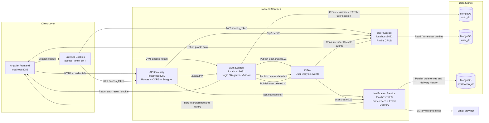
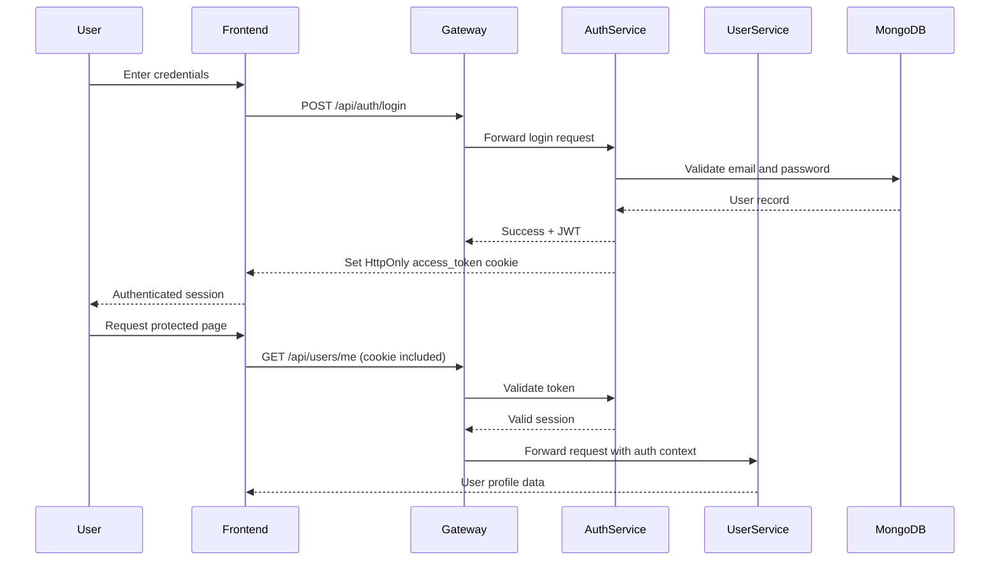
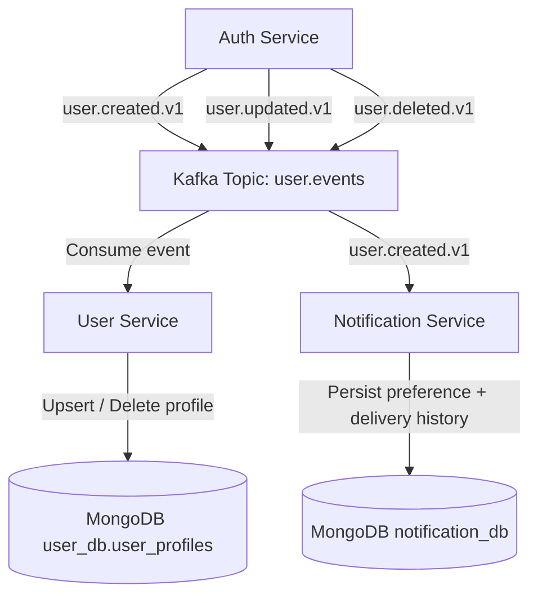

# Project Architecture

This document describes the current high-level architecture and runtime flow for the application.

## High-level architecture

## Request and authentication flow

## Event-driven synchronization flow

## Components

### API Gateway

- Routes requests to the auth, user, and notification services
- Centralizes Swagger and OpenAPI docs
- Handles CORS and credentials-aware browser traffic
- Forwards cookie-based authentication context to downstream services

### Auth Service

- Handles registration, login, logout, and refresh
- Validates credentials against MongoDB
- Creates and validates JWTs
- Emits user lifecycle events to Kafka

### User Service

- Owns user profile state in `user_db`
- Consumes Kafka events to keep profiles synchronized
- Enforces that users only access their own profile data

### Notification Service

- Stores notification preferences and delivery history
- Consumes `user.created.v1` and sends a welcome email when enabled
- Records failed or successful delivery attempts
- Uses optional SMTP configuration and degrades gracefully when email is not configured

## Data model

- `auth_db.auth_users`: authentication records
- `user_db.user_profiles`: synced profile data
- `notification_db.notification_preferences`: per-user email preference
- `notification_db.notification_records`: delivery history and outcomes

## Operational notes

- Browser sessions use HttpOnly cookies; no token is stored in localStorage
- Kafka keeps the services loosely coupled and resilient to async propagation
- The gateway acts as the single public interface for client traffic
- The backend supports both local containerized runs and production deployment via Docker Compose and the `deploy.sh` helper
