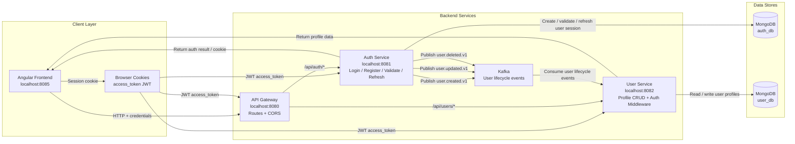
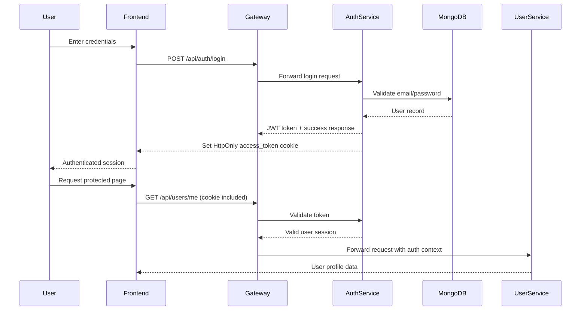
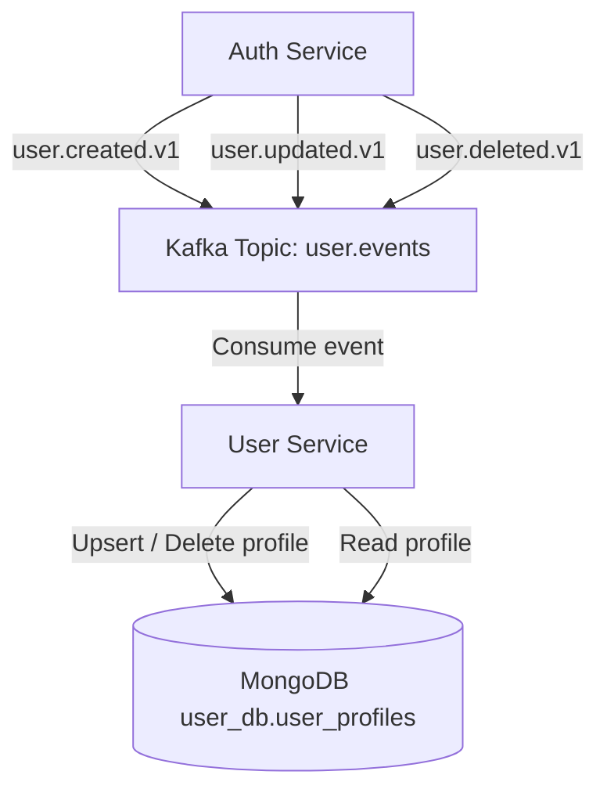

# Backend Architecture Diagram

This document defines the complete backend flow for the application, including the client, API gateway, auth service, user service, MongoDB storage, and Kafka event sync.

## High-level architecture

## Authentication flow

## User profile synchronization flow

## Request lifecycle summary

1. The frontend sends requests to the API gateway.
2. The gateway routes the request to the relevant microservice.
3. Auth service handles login, registration, token validation, refresh, and logout.
4. User service handles profile retrieval, updates, listing, and deletion.
5. JWT is stored in an HttpOnly cookie named `access_token`.
6. Events are published to Kafka when user lifecycle changes occur.
7. User service consumes those events to keep the profile database synchronized.

## Notes

- `auth-service` owns `auth_db` authentication data.
- `user-service` owns `user_db` profile data.
- The API gateway acts as the single entry point for frontend traffic.
- Cookie-based auth is used for browser sessions, while JWT validation also supports Bearer token fallback in some flows.
